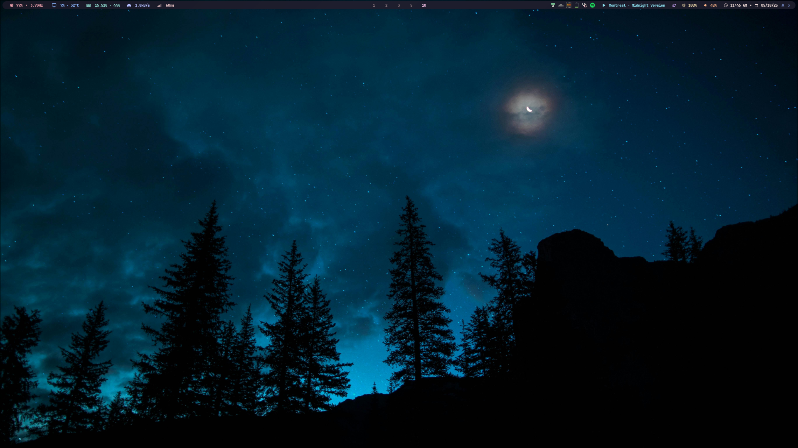

A sleek and minimalist desktop setup for Arch Linux powered by [Hyprland](https://github.com/hyprwm/Hyprland), optimized for performance, aesthetics, and productivity.

---

## 📦 Requirements

- A working Arch Linux installation
- Basic familiarity with the terminal and git

---

## 🛠️ Installation Guide
- Coming soon
